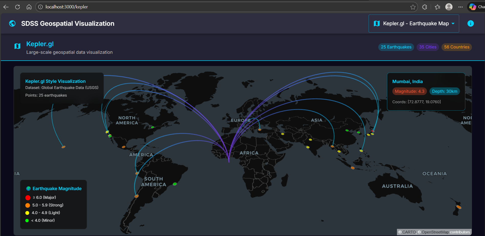
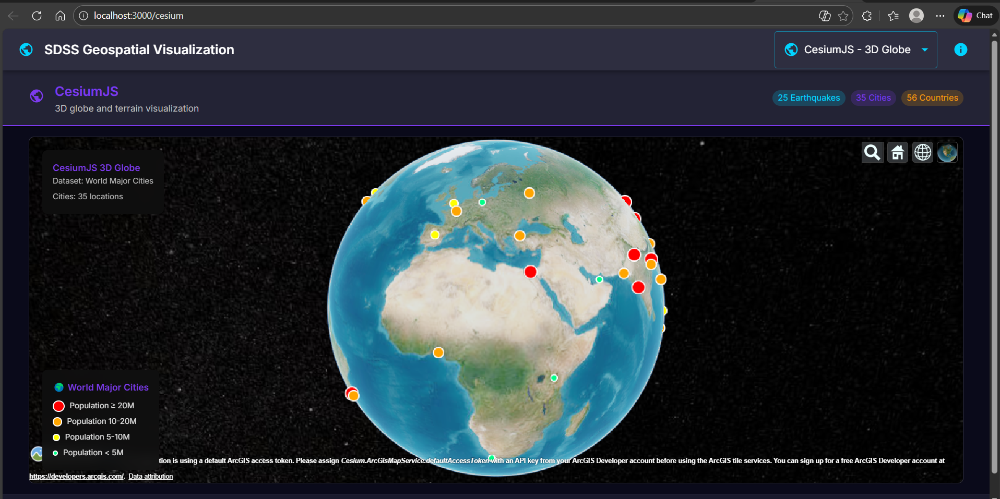
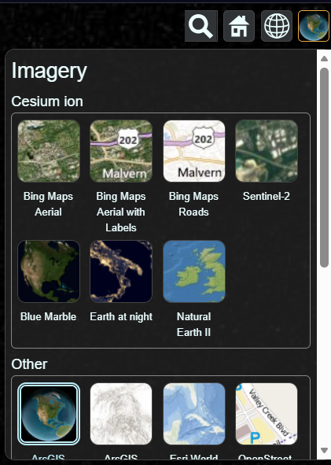
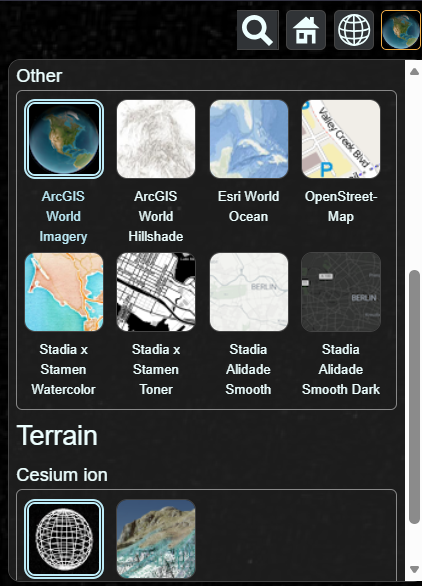
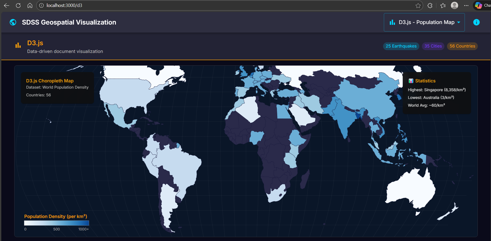

# Geospatial Data Visualization

This is my assignment project for GIE 419 (Spatial Decision Support Systems). I built a web app that shows off three different JavaScript libraries for mapping - Kepler.gl, CesiumJS, and D3.js.

## What I Made

Basically it's a full-stack app where you can switch between different map visualizations using a dropdown. Each one shows different data:

- Earthquake locations around the world (Kepler.gl)
- Major cities on a 3D globe (CesiumJS)
- Population density by country (D3.js)

## Screenshots

### Kepler.gl - Earthquake Map


This one uses WebGL to render earthquake data. The circles get bigger based on magnitude and change color depending on how strong the earthquake was.

### CesiumJS - 3D Globe







The 3D globe was probably the coolest to build. You can spin it around, zoom in, and click on cities to see their population. Red dots are megacities (20M+), orange is 10-20M, etc.

### D3.js - Population Density


Classic choropleth map showing how densely populated each country is. Darker blue = more people per km². Singapore is basically black lol.

## Tech Used

**Backend:** Node.js, Express

**Frontend:** React, Material-UI, Deck.gl, CesiumJS, D3.js

## How to Run

```bash
# install everything
npm install
cd client && npm install
cd ..

# run it
npm run dev
```

Then open http://localhost:3000

## API

The backend has a few endpoints:

- `/api/data/earthquakes` - earthquake geojson
- `/api/data/cities` - city data with populations
- `/api/data/population` - country density stats

## Project Files

```
├── server/
│   ├── index.js
│   └── routes/data.js
├── client/
│   └── src/
│       ├── App.js
│       └── components/
│           ├── KeplerVisualization.js
│           ├── CesiumVisualization.js
│           └── D3Visualization.js
├── screenshots/
└── package.json
```

---

Made for GIE 419 - SDSS Assignment 3
